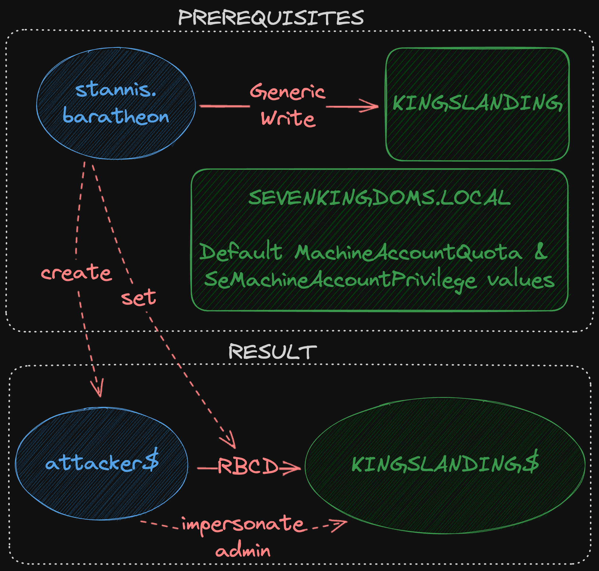
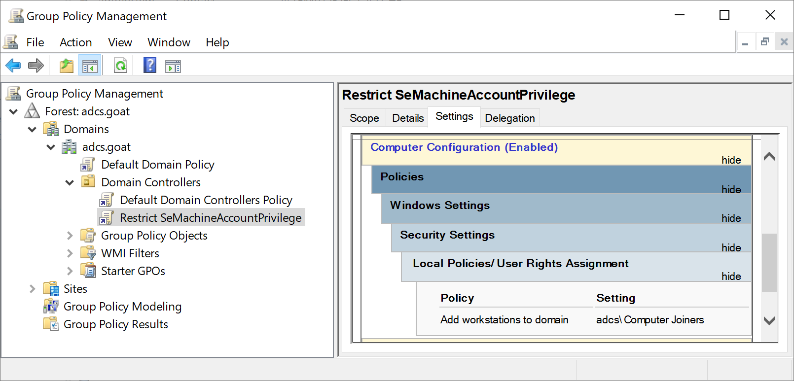
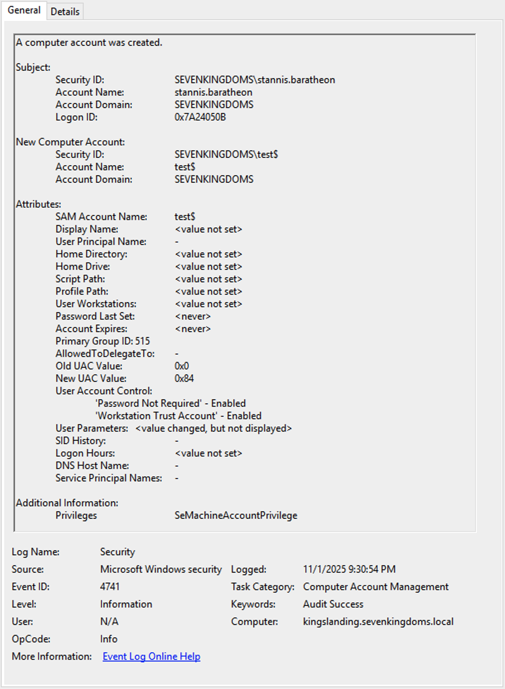
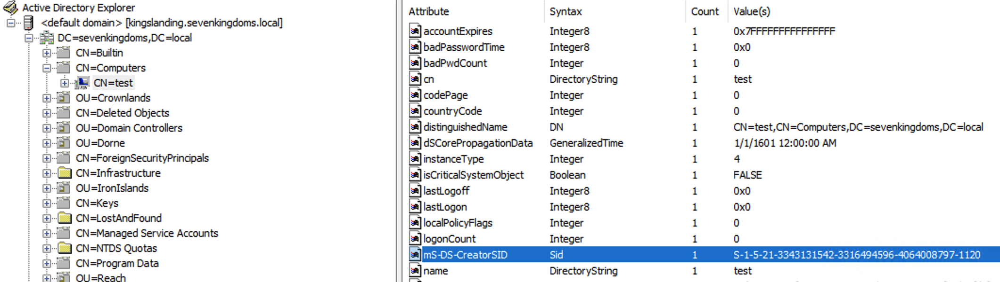
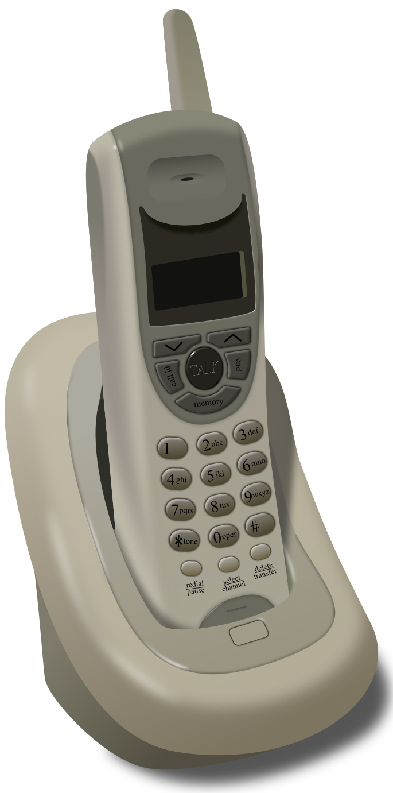

# Making $ With COMPUTER$
## Queen City Con 0x3
### John Askew & Jake Hildreth
#### 2025-11-07

<!--
Both, Jake Starts

Next: John
-->

---


# John
Hacker
Red Team Lead

<!--
John

Next: Jake
-->

---

# Jake

Defender
Security Consultant

<!--
Jake

Next: John
-->

---

# Agenda

- The Problem
- Some Context
- A Demo or Two
- Some Solutions

<!--
John

Next: Jake
-->

---

# **The Problem**

---
<!-- _transition: none -->

## If a user can join a computer to your domain
## they can own your Active Directory forest

<!--
Jake

Next: Jake
-->

---
## If a user can join a computer to your domain
## they can own your Active Directory forest in **minutes**

<!--
Jake

Next: Jake
-->

---

# The Problem
- `ms-DS-MachineAccountQuota` attribute
  * Number of computers a single user can add to the domain
  * Active Directory (AD) default value: 10
- `SeMachineAccountPrivilege` User Right
  * Who is allowed to add computers to a domain
  * AD default: Authenticated Users
* Made sense 25 years ago
* But now computers are more dangerous!

<!--
Jake

Next: John
-->

---


# This Also Made Sense 25 Years Ago:


---

# Why This Matters:
* MACHINE$ accounts are valuable to attackers!
* MANY attack chains need an attacker-controlled machine account
* Defaults = easier to create one than to compromise one
* Remove defaults -> break attack chains

<!--
John

Next: Jake
-->

---

# **Some Context**

---

# What Makes Computer Accounts Special?
- Password differences:
  * Complex & 120 characters long
  * Changed automatically every 30 days
- Service Principal Names (SPNs)
  * Tells others what services are available
* Note: local admin password is NOT the computer account password
<!--
Jake
COMPUTERS INITIATE THE PASSWORD CHANGE

Next: John
-->

---

# The Attacker's Advantage
- Machine accounts...
  * tend to be less scrutinized (evasion, persistence)
  * often have different permissions (privilege escalation)
  * can be created without creds using relaying (initial access)
* Controlling an SPN is a powerful attack primitive!
  - (You are a legitimate Active Directory service)

<!--
John

Next: Jake & John
-->

---

# Real-World Experience
- How common is this?
  * Jake: 80% at default
  * John: never seen it set properly when first engaging a customer
- Why hasn't this been fixed?
  * Relatively unknown outside security circles
  * Conflicting hardening guidance
  * Operations > Security

<!--
Jake & John

Next: John -->

---

# **A Demo or Two**
<!--
John

Next: John
-->

---

# **A Demo or Two (It's Actually Three)**
<!--
John

Next: John
-->

---


# Demo Environment
- Game of Active Directory (by Mayfly277)
  - https://github.com/Orange-Cyberdefense/GOAD
- Tools used:
  - https://github.com/fortra/impacket
  - https://github.com/Pennyw0rth/NetExec
  - https://github.com/CravateRouge/bloodyAD
  - https://github.com/ly4k/Certipy

<!--
John

Next: John
-->

---

# Demo: Privilege Abuse
* Look for extra permissions granted to Domain Computers
  * Added to privileged groups?
  * Access to other AD objects via ACLs?
* Create a machine account and you can abuse those permissions

<!--
John

Next: John
-->

---

# Demo: Delegation Abuse
* Active Directory account delegation is EASY to misconfigure
* "Resource-Based Constrained Delegation" is maybe the most commonly abused
* Turn a "GenericWrite" permission on a computer object into a full compromise
* https://eladshamir.com/2019/01/28/Wagging-the-Dog.html

<!--
John

Next: John
-->

---



<!--
John

Next: John
-->

---

# Demo: AD CS Abuse
* Active Directory Certificate Services is EASY to misconfigure
* Domain Computers are often allowed to enroll templates (ESC1)
* Turn `altSecurityIdentities` write access into a full compromise (ESC14A)
  - (The default Domain Computers cert template meets all other attack requirements)
* References:
  - https://posts.specterops.io/certified-pre-owned-d95910965cd2
  - https://posts.specterops.io/adcs-esc14-abuse-technique-333a004dc2b9

<!--
John

Next: John
-->

---

# Many Other Attacks
* Persistence using "stale" machine accounts
* Unconstrained Delegation & Constrained Delegation attacks
* CVE-2021-42278 & 42287 ("noPAC" privilege escalation)
* "SPN-in-the-Middle"
* "DumpGuard" technique
  - https://specterops.io/blog/2025/10/23/catching-credential-guard-off-guard/
* Whatever next thing comes out

<!--
John

Next: Jake
-->

---

# **Some Solutions**

<!--
Jake

Next: Jake
-->

---

# Prevention:
## Set `ms-DS-MachineAccountQuota` to 0
```powershell
#requires -Modules ActiveDirectory

# Set variables
$MAQ = 'ms-DS-MachineAccountQuota'
$Domain = Get-ADDomain -Identity example.com

# Set Correct Value
Set-ADDomain -Identity $Domain -Replace @{$MAQ=0}
```
Now only Administrators can add computers to domain without first precreating a computer account.

<!--
Jake

Next: Jake
-->

---
# Prevention:
## Restrict `SeMachineAccountPrivilege`


<!--
Jake

Next: Jake
-->

---

# Prevention:
## Follow New Domain Join Guidance: Additional Prep
Configure Trusted Computer Account Owners:


<!--
Jake

Next: Jake
-->

---

# Prevention:
## Follow New Domain Join Guidance: Perform
1. Admin01, *a Trusted Computer Account Owner,* pre-creates the Computer object in a target OU/container
2. Admin02, *a Computer Joiner,* performs domain join w/minimal privileges required
<br>

<sub>More details, including required permissions for each admin:
https://learn.microsoft.com/en-us/windows-server/identity/ad-ds/manage/active-directory-domain-join-permissions</sub>

<!--
Jake

Next: Jake
-->

---

# Prevention:
## Offline Domain Join (more secure!)
1. Using a _Trusted Computer Account Owner_ with appropriate permissions, provision a new computer object:
    ```
    djoin /provision /domain contoso.com /machine NewComputer /savefile offlinedomainjoin.txt
    ```
2. On physical computer, complete the join:
    ```
    djoin /requestODJ /loadfile offlinedomainjoin.txt /windowspath %SystemRoot% /localos
    ```

### No additional permissions are required!
<sub>More details:
https://learn.microsoft.com/en-us/windows-server/remote/remote-access/directaccess/directaccess-offline-domain-join</sub>

<!--
Jake

Next: Jake
-->

---



# Detection
## Monitor for New Machine Accounts
- Event ID 4741 is logged on Domain Controllers
* (you ARE collecting logs from ALL your domain controllers... right!?)

<!--
Jake

Next: Jake
-->

---

# Detection
## Investigate Machine Accounts
- The machine account creator is indicated in the `mS-DS-CreatorSID` field
- By default the user account cannot delete the machine account it created
- https://learn.microsoft.com/en-us/windows/win32/adschema/a-ms-ds-creatorsid


<!--
Jake

Next: Jake
-->

---

# Remediation:
## Find Inactive and Suspicious Computer Objects:
Huy Kha (aka DebugPrivilege) wrote an article with an easy-to-use script that finds computer accounts that look *funky*

https://medium.com/@Debugger/machines-gone-rogue-a01d726f5f10

<!--
Jake

Next: Jake
-->

---

# **Outro** 🎸

<!--
Jake

Next: John
-->

---


# Key Takeaways
- Design decisions from 25 years ago aren't always so great
- Computer accounts are more dangerous than most people realize
- There are multiple attack paths from COMPUTER$ to $
- Defense requires technical controls AND organizational change

<!--
John

Next: Jake
-->

---


# Call to Action

- Check your environment TODAY
- Start the conversation with your security and identity teams
- Don't wait for an incident to fix this

<!--
Jake

Next: Both
-->

---

# Resources
https://github.com/jakehildreth/QueenCityCon25 


<!--
Both

Next: Both
-->

---

# Thanks!

| | John Askew | Jake Hildreth |
|-|-|-|
| Email | john@terrapinlabs.io | jake@jakehildreth.com |
| Web | terrapinlabs.io | jakehildreth.com |
| GitHub | sk3w | jakehildreth |
| LinkedIn | /in/sk3w | /in/jakehildreth |
| BlueSky | @sk3w.bsky.social | @dotdot.horse |
| QR 😉 | |  |